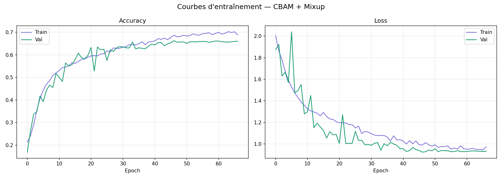
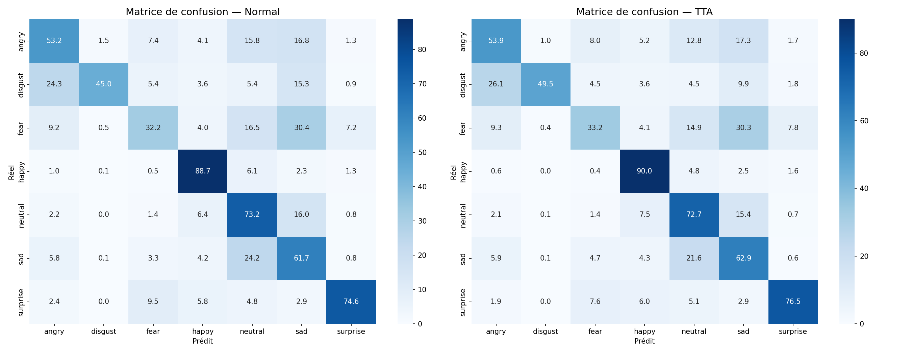
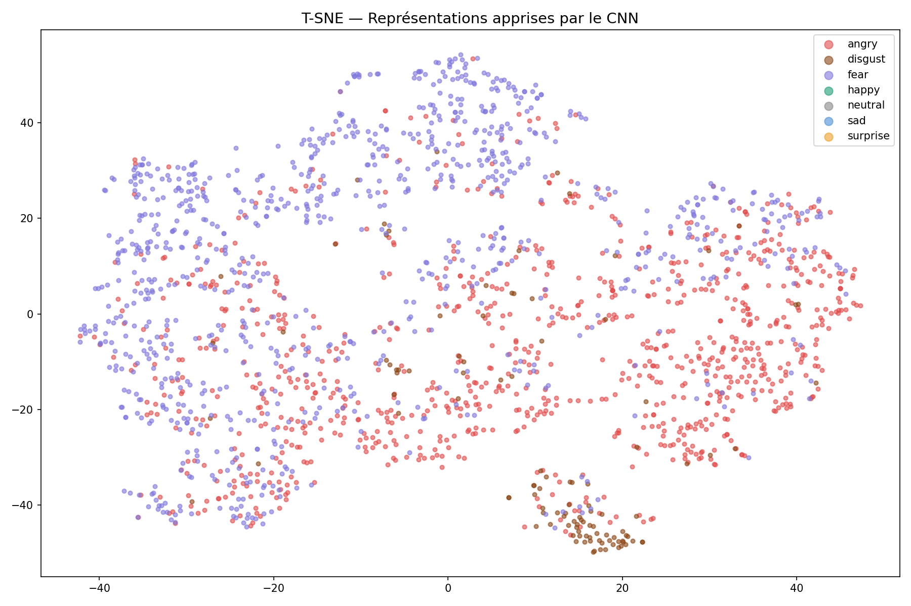

# FaceRead

CNN trained from scratch on FER2013 for real-time facial emotion recognition (7 classes).

No transfer learning, no pretrained weights. Everything trained from zero.

## Results

Test accuracy: 66.87% (67.30% with TTA)

FER2013 is a fairly noisy dataset - a lot of images are mislabeled or ambiguous even for a human. Most from-scratch models in the literature land between 64% and 76%, so this result is consistent with the state of the art.

I tested 4 different architectures to check this ceiling:

| Model | Test Accuracy |
|-------|---------------|
| CNN v1 | 65.74% |
| CNN v2 (best) | 66.87% |
| ResNet from scratch | 66.55% |
| CBAM + Mixup + TTA | 67.30% |

Per-class breakdown (CNN v2):

| Emotion | Precision | Recall | F1 |
|---------|-----------|--------|-----|
| Happy | 0.86 | 0.90 | 0.87 |
| Surprise | 0.82 | 0.77 | 0.78 |
| Angry | 0.67 | 0.54 | 0.60 |
| Neutral | 0.57 | 0.73 | 0.64 |
| Sad | 0.51 | 0.63 | 0.56 |
| Disgust | 0.77 | 0.50 | 0.60 |
| Fear | 0.60 | 0.33 | 0.43 |

Fear and Sad are the hardest classes - they often get confused with Neutral/Angry.

## Architecture

```
Input (48x48x1 grayscale)
  Block 1: Conv2D(64)x2 -> BN -> ReLU -> MaxPool -> Dropout
  Block 2: Conv2D(128)x2 -> BN -> ReLU -> MaxPool -> Dropout
  Block 3: Conv2D(256)x2 -> BN -> ReLU -> MaxPool -> Dropout
  Block 4: Conv2D(512) -> BN -> ReLU -> MaxPool -> Dropout
  GlobalAveragePooling2D
  Dense(512) -> BN -> ReLU -> Dropout(0.5)
  Dense(256) -> BN -> ReLU -> Dropout(0.3)
  Dense(7, softmax)
```

~2.7M parameters.

## Dataset

FER2013, 35887 grayscale images, 48x48px.

- Train: 24402
- Val: 4307
- Test: 7178

## Training

- Adam, lr=0.0003
- Categorical crossentropy
- EarlyStopping (patience=15), max 100 epochs
- Augmentation: rotation, shift, horizontal flip, zoom
- ReduceLROnPlateau + ModelCheckpoint
- Trained on Colab T4

## Visualizations





## Stack

Python 3.11, TensorFlow 2.19/Keras, OpenCV, NumPy, scikit-learn

## Setup

git clone https://github.com/skampoo93/faceread.git
cd faceread
python3 -m venv env
source env/bin/activate
pip install -r requirements.txt

## License

MIT
